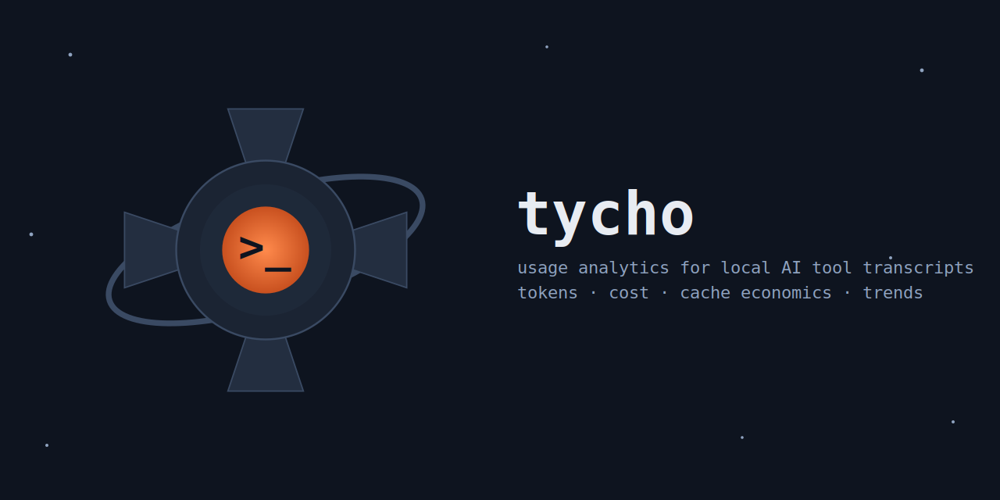

<p align="center">
  
</p>

#  tycho

Fast, privacy-first usage analytics for local AI tool transcripts and response
logs: tokens, cost, cache economics, and trends by day, project, session, and
model. It scans [Claude Code](https://code.claude.com), Codex, Pi, and
readable OpenAI JSONL usage records. Think `iostat` for AI spend.


```
$ tycho cache --model claude
Your effective cost was $3986.99. Without prompt caching it would have been $23751.08.
Caching saved you $19764.08 (6.0x leverage).
72.8% of your cache writes used the 1-hour TTL, costing $335.02 more than the 5-minute rate.

┌───────────────────────────┬───────────────┬────────────┬────────────┬──────────┬─────────────┬───────────────┬───────────┬──────────┐
│ Model                     ┆ Cache Read    ┆ Write 5m   ┆ Write 1h   ┆ Hit Rate ┆ Actual Cost ┆ No-Cache Cost ┆ Savings   ┆ Leverage │
╞═══════════════════════════╪═══════════════╪════════════╪════════════╪══════════╪═════════════╪═══════════════╪═══════════╪══════════╡
│ claude-fable-5            ┆ 1,725,981,694 ┆ 12,273,214 ┆ 34,097,572 ┆ 97.4%    ┆ $3056.13    ┆ $18218.30     ┆ $15162.18 ┆ 6.0x     │
│ claude-opus-5             ┆ 773,885,577   ┆ 1,080,620  ┆ 10,594,173 ┆ 98.5%    ┆ $562.57     ┆ $3990.74      ┆ $3428.16  ┆ 7.1x     │
│ claude-opus-4-8           ┆ 157,197,715   ┆ 2,165,910  ┆ 8,396,743  ┆ 93.7%    ┆ $221.70     ┆ $884.40       ┆ $662.70   ┆ 4.0x     │
│ claude-sonnet-5           ┆ 288,610,690   ┆ 4,539,956  ┆ 5,379,203  ┆ 96.7%    ┆ $114.76     ┆ $621.23       ┆ $506.47   ┆ 5.4x     │
│ claude-sonnet-4-6         ┆ 1,723,659     ┆ 1,610,182  ┆ 0          ┆ 51.7%    ┆ $31.37      ┆ $34.82        ┆ $3.45     ┆ 1.1x     │
│ claude-haiku-4-5-20251001 ┆ 1,303,985     ┆ 178,670    ┆ 0          ┆ 87.9%    ┆ $0.47       ┆ $1.60         ┆ $1.13     ┆ 3.4x     │
│ Total                     ┆ 2,948,703,320 ┆ 21,848,552 ┆ 58,467,691 ┆ 97.3%    ┆ $3986.99    ┆ $23751.08     ┆ $19764.08 ┆ 6.0x     │
└───────────────────────────┴───────────────┴────────────┴────────────┴──────────┴─────────────┴───────────────┴───────────┴──────────┘
```

Cache writes are split by TTL because Anthropic bills a 1-hour write at 2x
base input and a 5-minute write at 1.25x. The premium line above is what that
choice cost over the cheaper rate.

## Install

The package is `tycho-cli`; the installed binary is `tycho`.

**From source** (works today; requires Rust 1.88+ stable):

```sh
cargo install --git https://github.com/vscarpenter/tycho-cli
```

**Prebuilt binaries and installers** (available with each tagged release):

```sh
# Homebrew (macOS/Linux)
brew install vscarpenter/tap/tycho

# Shell installer (macOS/Linux)
curl --proto '=https' --tlsv1.2 -LsSf \
  https://github.com/vscarpenter/tycho-cli/releases/latest/download/tycho-cli-installer.sh | sh

# PowerShell installer (Windows)
powershell -c "irm https://github.com/vscarpenter/tycho-cli/releases/latest/download/tycho-cli-installer.ps1 | iex"
```

Prebuilt archives for macOS (arm64/x86_64), Linux (arm64/x86_64), and Windows
(x86_64) are attached to each [GitHub Release](https://github.com/vscarpenter/tycho-cli/releases).

## Quickstart

```sh
tycho                 # daily token + cost table (the default command)
tycho cache           # what prompt caching is saving you
tycho sessions --limit 10 --sort tokens
tycho projects
tycho models
tycho monthly --csv > usage.csv
tycho doctor          # data-health: files, skipped lines, duplicates, span
tycho live            # a live dashboard that refreshes every 2 seconds
```

```
$ tycho daily --since 2026-07-01
┌────────────┬─────────┬─────────┬─────────────┬─────────────┬──────────────┬────────────┐
│ Date       ┆ Input   ┆ Output  ┆ Cache Write ┆ Cache Read  ┆ Total Tokens ┆ Cost (USD) │
╞════════════╪═════════╪═════════╪═════════════╪═════════════╪══════════════╪════════════╡
│ 2026-07-01 ┆ 57,502  ┆ 236,565 ┆ 1,043,016   ┆ 33,839,653  ┆ 35,176,736   ┆ $47.31     │
│ 2026-07-02 ┆ 422,681 ┆ 990,627 ┆ 6,125,572   ┆ 199,047,245 ┆ 206,586,125  ┆ $221.98    │
│ 2026-07-03 ┆ 290,698 ┆ 760,432 ┆ 3,690,105   ┆ 464,019,926 ┆ 468,761,161  ┆ $295.94    │
│ Total      ┆ 770,881 ┆ 1,987,… ┆ 10,858,693  ┆ 696,906,824 ┆ 710,524,022  ┆ $565.23    │
└────────────┴─────────┴─────────┴─────────────┴─────────────┴──────────────┴────────────┘
```

## Commands

| Command | Purpose |
|---|---|
| `tycho daily` | Per-day tokens and cost (default when run bare) |
| `tycho monthly` | Same shape, monthly buckets |
| `tycho sessions` | Per-session: start, duration, project, models, tokens, cost. `--limit N`, `--sort start\|tokens\|duration` |
| `tycho projects` | Rollup by project directory |
| `tycho models` | Rollup by model |
| `tycho cache` | Cache economics: hit rate, actual vs no-cache cost, savings, leverage |
| `tycho doctor` | Data health: files, skipped lines, duplicates collapsed, date span, unpriced models |
| `tycho live` | Live dashboard: today's totals, 10-minute burn rate, per-model split, cache gauge, active project |
| `tycho blocks` | Per 5-hour billing block: tokens, cost, models, and the active block's projected total |

### `tycho blocks`

Groups usage into **activity-anchored 5-hour billing blocks** that mirror how
Claude's usage limits reset: a block starts at your first message (floored to
the hour) and spans five hours; a new block begins at the next message once
that window closes. For the block containing "now", tycho projects where its
cost lands if the current rate holds — `$2.05 so far, ~$4.10 projected by
17:00`. Since the 5-hour reset is a Claude-specific mechanic, `blocks`
defaults to Claude events only; pass `--provider codex`, `--provider pi`, or
`--provider openai` to switch it to another provider's events, or `--provider all` to include
every provider. Honors the usual filters and `--json`; `--csv` is not
supported.

```
$ tycho blocks
Active block: $2.05 so far, ~$4.10 projected by 17:00 (612 tok/min).

Block (5h)          │ Status              │ Total Tokens │ Cost (USD)
07-04 09:00 – 14:00 │ 5h                  │ 12,431,002   │ $8.10
07-04 14:00 – 19:00 │ ● active · 2h30m left │ 3,120,540  │ $2.05 → ~$4.10
```

### `tycho live`

A [ratatui](https://ratatui.rs) dashboard that re-scans every 2 seconds on a
background thread, so the UI stays responsive. It shows today's totals and
cost, a tokens-per-minute burn rate over the last 10 minutes (with a
sparkline), a cache hit-rate gauge, the per-model split, today's sessions, and
the active project — detected from the most recently written transcript file.
Keys: `q` (or `Esc`/`Ctrl-C`) quits, `Tab` cycles the Overview / Sessions /
Models views. It ignores `--since`/`--until` (it is always "now") but honors
`--dir`, `--project`, `--model`, `--mode`, `--pricing`, and `--tz`/`--utc`.

`tycho live --json` — or `live` with a piped/redirected (non-TTY) stdout —
prints a single JSON snapshot of the dashboard state and exits, so it never
corrupts a pipe and can feed a status bar or script.

Global flags on every command: `--dir <PATH>` (repeatable; replaces default
search roots), `--since`/`--until` (inclusive dates in the report timezone),
`--project <SUBSTR>`, `--model <SUBSTR>`, `--provider claude|codex|pi|openai|all`
(filters to one provider's events, or `all` for every provider; `blocks`
defaults to `claude` and this flag overrides it), `--tz <IANA>`/`--utc`,
`--mode auto|calculate|display`,
`--pricing <PATH>`, `--precise`, `--json`. `--csv` works on `daily`,
`monthly`, and `sessions`.

`--json` output is a stable, documented contract — treat it as the scripting
API. Fields are added over time but never renamed or removed.

## Where the data comes from

By default, `tycho` scans these read-only roots when they exist, each tagged
with the provider that owns its layout:

- Claude Code JSONL transcripts under `~/.claude/projects/`, or the
  directories in `CLAUDE_CONFIG_DIR` (Claude).
- Xcode's `CodingAssistant` Claude location on macOS (Claude).
- Codex JSONL session logs under `$CODEX_HOME/sessions` or
  `~/.codex/sessions` (Codex).
- Codex rollouts for archived threads, under `$CODEX_HOME/archived_sessions`
  or `~/.codex/archived_sessions` (Codex).
- Pi JSONL session logs under `$PI_CODING_AGENT_DIR/sessions` or
  `~/.pi/agent/sessions` (Pi). `PI_CODING_AGENT_DIR` names Pi's *agent*
  directory, so when set it replaces `~/.pi/agent` whole.

Ollama Cloud models (`glm-5.3:cloud` and friends) are metered per token and
carry real rates, so their spend appears in every total. Locally-run Ollama
models — an id with a quantization or size tag and no pricing entry, like
`qwen3.8:27b` — stay at $0, which is what local inference costs. The three
ids that are billed on Ollama Cloud but indistinguishable from a local pull
(`gpt-oss:120b`, `gpt-oss:20b`, `qwen3.5:397b`) are priced as cloud; zero
them in `~/.config/tycho/pricing.toml` if you run them on your own hardware.

Claude Code resolves its config directory from the running environment's home
(`CLAUDE_CONFIG_DIR`, else `~/.claude`) with no platform-specific branch, so
Windows uses `%USERPROFILE%\.claude\projects` and the Claude desktop app's
locally-run sessions land in the same place as the CLI's. Under WSL, though,
`claude` on Windows and `claude` in the distro keep *separate* stores; a
Linux-native tycho sees only the distro's. `doctor` prints an "Unscanned
(WSL)" row when it spots a Windows-side store under `/mnt`, which you can
then include via `CLAUDE_CONFIG_DIR`:

```
CLAUDE_CONFIG_DIR=$HOME/.claude,/mnt/c/Users/<you>/.claude tycho
```

Claude roots parse only Claude's `assistant` records; Codex roots parse only
Codex's token-count records; Pi roots parse only its `message` records whose
role is `assistant`. `--dir <PATH>` (repeatable) replaces the default
roots entirely with your own directories, tagged `External`; those are
format-sniffed line by line — tycho tries the Claude shape, then Codex's, then
falls back to a standalone OpenAI Responses API or Chat Completions record,
gated only on a top-level `usage` object being present. Because that gate
doesn't check for OpenAI-specific fields, a `--dir` directory should contain
only usage logs: any foreign JSONL line that happens to carry a `usage` object
is counted as an event. The current macOS ChatGPT desktop conversation cache
is opaque `.data` storage rather than plain JSONL usage records, so tycho does
not scan that cache by default — point `--dir` at an actual export/log
directory instead.

`tycho` streams each file, collapses duplicate streaming records, and
aggregates. A full scan of 500 MB takes well under a second on an Apple
M-series machine.

## Pricing

A default pricing table (USD per million tokens) ships inside the binary. It
covers Anthropic, OpenAI, Google Gemini, Meta Muse Spark, xAI Grok, Qwen on
Alibaba Cloud, and Ollama Cloud, including Claude cache-write TTL splits and
each vendor's cached-input rate; its sources and verification dates are
recorded in [`pricing/default.toml`](pricing/default.toml). Override any model — or add
new ones — at `~/.config/tycho/pricing.toml` (or `$XDG_CONFIG_HOME/tycho/`),
or per run with `--pricing <PATH>`. Models with no pricing entry cost $0,
warn once on stderr, and are listed by `doctor`.

Because those $0 models would otherwise vanish silently from a total, `doctor`
reports how many tokens carry no real rates and — via an optional `[shadow]`
section in the pricing table — what they would have cost at a reference
model's rates:

```
Unpriced tokens     419,779,330 across 6 models
Shadow estimate     $176.64 at reference rates (see [shadow] in pricing)
```

The shadow estimate is a diagnostic. It never enters any cost, never changes a
report total, and appears in no report but `doctor`. A model with no `[shadow]`
entry contributes its tokens and no dollars — a rate is never invented for it,
which is why `codex-unknown` is deliberately left unmapped.

Cost modes mirror ccusage: `--mode auto` (default) uses a record's
pre-computed `costUSD` when present **and non-zero**, and calculates
otherwise; `calculate` always prices from tokens; `display` only sums
recorded `costUSD` values
(modern Claude Code and Codex records don't write `costUSD`, so `display` is
only meaningful for old transcripts or custom logs that include recorded cost).

## Accuracy caveats

- `output_tokens` in transcripts can be a mid-stream snapshot rather than
  the final count, so output tokens may be undercounted
  ([claude-code#27361](https://github.com/anthropics/claude-code/issues/27361)).
  Numbers are estimates for trend analysis, **not an invoice reconciliation
  tool**.
- Claude Code prunes old transcripts based on its `cleanupPeriodDays`
  setting, and Codex/ChatGPT local retention can also change, so history has a
  horizon. `tycho doctor` prints the observed date span.
- Claude fast mode bills at a premium ($10/$50 per million on `claude-opus-5`
  vs. the standard $5/$25) but records the same model id, so tycho can't tell
  the two apart. Override the model if your usage is predominantly fast mode.
  `claude-sonnet-5`'s $2/$10 launch rate became its permanent price on
  2026-08-11, so no bump is scheduled.
- Some built-in rates are dated. Gemini 3.8 and 3.7 Flash carry Google's
  introductory price through 2026-12-31 (then $1.50/$7.50), `gpt-5.6-sol`
  carries a promotional rate OpenAI guarantees through at least 2026-11-21,
  and Ollama's DeepSeek rows are its weekday peak (12:00 to 18:00 UTC) rate
  with off-peak at half. Override at `~/.config/tycho/pricing.toml` when the
  calendar or your traffic pattern says otherwise.
- OpenAI subscription-plan usage is not the same as API invoicing. Built-in
  OpenAI prices estimate API-equivalent token cost; override pricing for long
  context, Batch, Flex, Priority, data residency, or workspace-specific rates.
- Codex rollouts whose context lines were trimmed (resumed sessions) record
  usage before naming their model. tycho recovers the model from the file's
  first `turn_context` and reports the count as "Codex models backfilled" in
  `tycho doctor`. This lands spend that earlier versions priced at $0, so
  historical totals can *increase* after upgrading.
- Historical/private Codex labels with no public API rate are explicitly
  priced at $0 to avoid noisy warnings; `doctor` lists them separately as
  "Zero-rated models" rather than mixing them in with genuinely unpriced
  models. Override them at `~/.config/tycho/pricing.toml` if your account
  bills those labels differently.
- Ollama-style local model ids (`name:tag`) carry no pricing entry at all;
  `doctor` lists them separately as "Local models" instead of warning about
  them every run.

## Privacy

1. **Read-only.** tycho never writes inside any supported tool config directory.
2. **No network calls at runtime.** Pricing is embedded or read from local
   config. No telemetry, ever.
3. **Message content is never parsed, displayed, exported, or persisted.**
   The deserialization types capture only the metadata envelope (ids,
   timestamps, model, token counts) — there is no field that could hold
   content, so leaking it is structurally impossible. Transcripts can
   contain secrets; this design keeps them out of tycho entirely.

## Prior art

[ccusage](https://github.com/ryoppippi/ccusage) (TypeScript) proved the
demand for this kind of tool and defined the cost-mode semantics tycho
mirrors. tycho is the Rust-native take with a stronger cache-economics
story.

## License

[MIT](LICENSE) © Vinny Carpenter.
